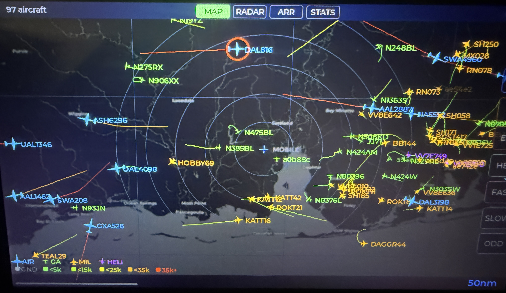
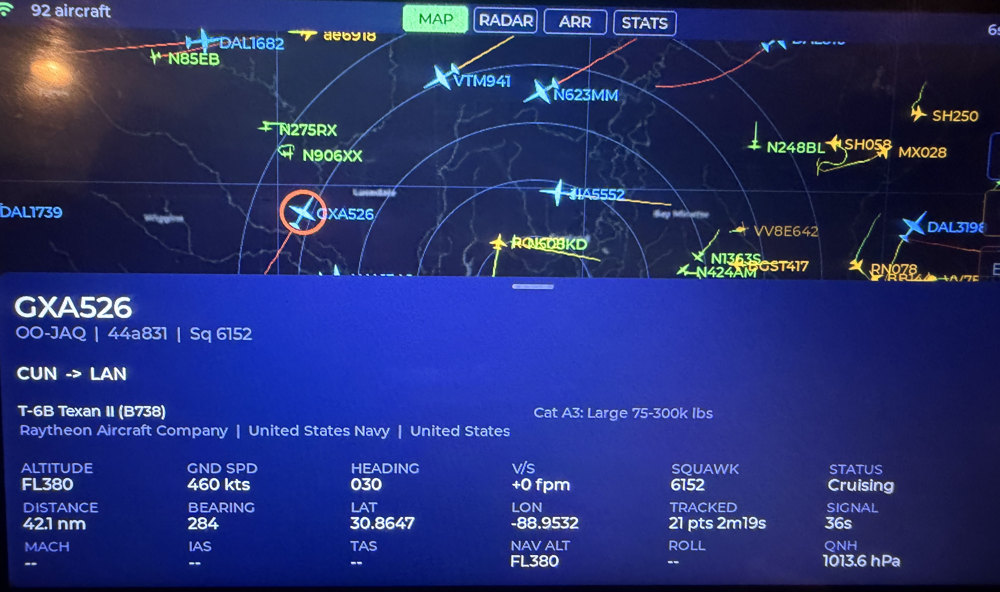
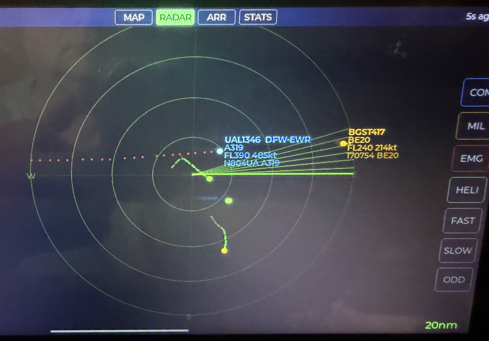
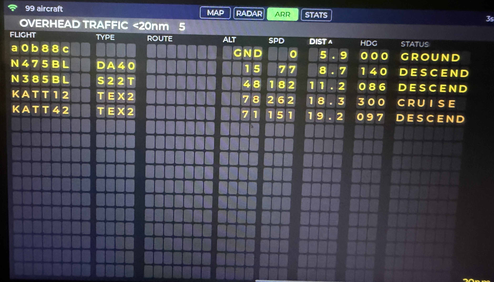
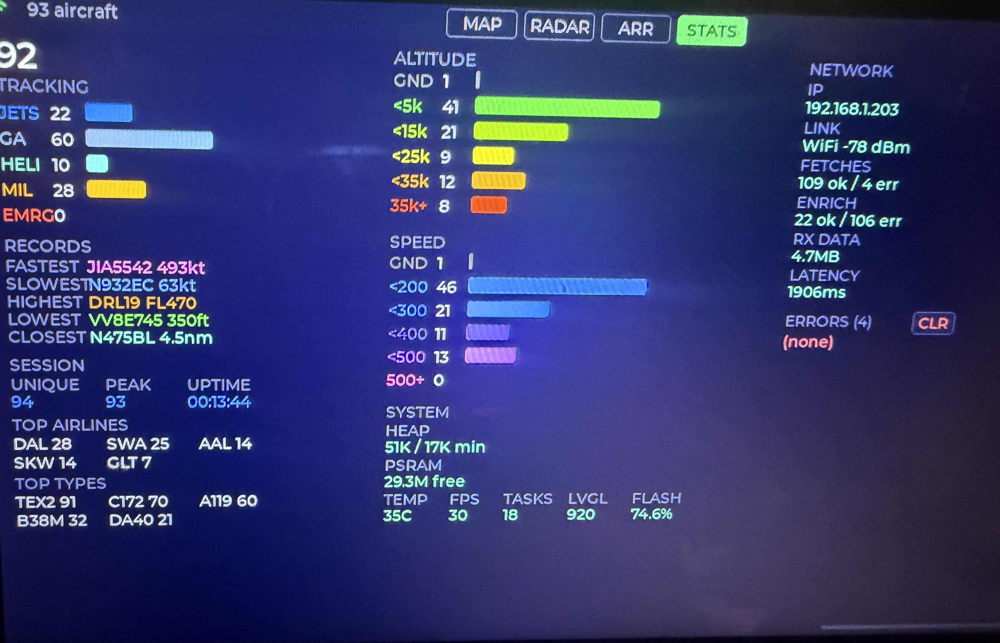
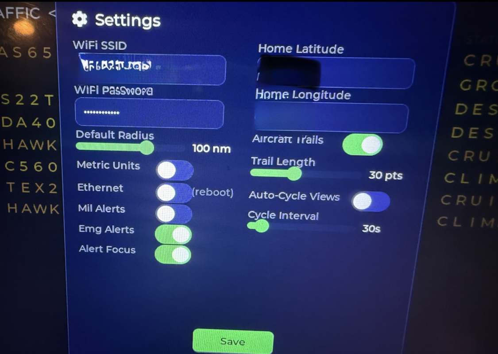

# ADS-B Radar Display

Real-time aircraft tracker on an ESP32-P4 with a 1024x600 touchscreen. Pulls live ADS-B data from [adsb.lol](https://api.adsb.lol) and displays aircraft on four swipeable views.


## Screenshots

| | |
|---|---|
|  |  |
| Main map screen | Aircraft detail |
|  |  |
| Radar simulation | Arrival board style view |
|  |  |
| Stats | Settings |

## Views

- **Map** — Top-down map with aircraft icons (airliner/jet/GA/heli), altitude-colored trails, and static pre-rendered OSM backgrounds at 6 zoom levels
- **Radar** — Rotating sweep with phosphor-style blips, paint-detail zone showing callsign/route/altitude as the sweep passes each aircraft
- **Arrivals** — Split-flap departure board with animated character flips, showing callsign, route, type, altitude, speed, distance, and status
- **Stats** — System health dashboard (heap, PSRAM, temperature, FPS, RTOS tasks, LVGL objects, flash), network stats (IP, fetch/enrich counts, latency, RSSI), and session tracking (unique aircraft, peak count, altitude/speed distributions, top airlines)

All views support:
- Tap any aircraft to open a scrollable detail card with enriched data (operator, registration, type, route, photo credits)
- Filter toggles: COM / MIL / EMG / HELI / FAST / SLOW / ODD
- Adjustable range: 150 / 100 / 50 / 20 / 5 / 1 nm
- Auto-cycle between views with configurable interval and touch-pause

## Hardware

**Board:** JC1060P470C (ESP32-P4 RISC-V, 32MB PSRAM, 16MB flash)
- 1024x600 MIPI-DSI display (JD9165 controller)
- GT911 capacitive touchscreen
- Built-in 100Mbps Ethernet (IP101 PHY)
- ESP32-C6 WiFi module (SDIO hosted)

> This project was built for the JC1060P470C board. See [Adapting to Other Boards](#adapting-to-other-boards) for how to port it to different ESP32 hardware.

---

## Getting Started (Step-by-Step)

This guide assumes you have a JC1060P470C board (or similar ESP32-P4 board) and have never flashed firmware before.

### Step 1: Install Software

You need two things: **VS Code** (a code editor) and **PlatformIO** (a build tool for embedded devices).

<details>
<summary><strong>Windows</strong></summary>

1. **Install VS Code**
   - Download from [code.visualstudio.com](https://code.visualstudio.com/)
   - Run the installer, accept defaults

2. **Install PlatformIO Extension**
   - Open VS Code
   - Click the Extensions icon in the left sidebar (or press `Ctrl+Shift+X`)
   - Search for **"PlatformIO IDE"**
   - Click **Install** — this takes a few minutes as it downloads compilers and tools
   - When prompted, restart VS Code

3. **Install USB Driver (if needed)**
   - Most Windows 10/11 systems auto-detect ESP32-P4 boards
   - If your board isn't recognized, install the [CP210x driver](https://www.silabs.com/developers/usb-to-uart-bridge-vcp-drivers) or [CH340 driver](http://www.wch-ic.com/downloads/CH341SER_ZIP.html) depending on your board's USB chip
   - The JC1060P470C uses USB CDC — no extra driver needed on Windows 10+

4. **Install Git**
   - Download from [git-scm.com](https://git-scm.com/download/win)
   - Run the installer, accept defaults

</details>

<details>
<summary><strong>macOS</strong></summary>

1. **Install VS Code**
   - Download from [code.visualstudio.com](https://code.visualstudio.com/)
   - Drag to Applications folder

2. **Install PlatformIO Extension**
   - Open VS Code
   - Click the Extensions icon in the left sidebar (or press `Cmd+Shift+X`)
   - Search for **"PlatformIO IDE"**
   - Click **Install** — this takes a few minutes
   - Restart VS Code when prompted

3. **Install Git** (if not already installed)
   - Open Terminal and run: `git --version`
   - If not installed, macOS will prompt you to install Xcode Command Line Tools — click **Install**

4. **USB Driver**
   - macOS includes CDC drivers — no extra install needed for the JC1060P470C
   - For boards using CP210x or CH340 chips, install the appropriate driver from the manufacturer

</details>

<details>
<summary><strong>Linux</strong></summary>

1. **Install VS Code**
   - Ubuntu/Debian: download the `.deb` from [code.visualstudio.com](https://code.visualstudio.com/) and run `sudo dpkg -i code_*.deb`
   - Arch: `sudo pacman -S code`
   - Or use `snap install --classic code`

2. **Install PlatformIO Extension**
   - Open VS Code
   - Click the Extensions icon (or press `Ctrl+Shift+X`)
   - Search for **"PlatformIO IDE"**
   - Click **Install**, restart VS Code when prompted

3. **Set up USB permissions**
   - Linux requires a udev rule to access serial devices without root:
     ```bash
     sudo usermod -a -G dialout $USER
     ```
   - **Log out and log back in** for the group change to take effect
   - Verify with: `groups` (should show `dialout`)

4. **Install Git** (if not already installed)
   ```bash
   # Ubuntu/Debian
   sudo apt install git

   # Fedora
   sudo dnf install git

   # Arch
   sudo pacman -S git
   ```

</details>

### Step 2: Download the Project

Open a terminal (or Git Bash on Windows) and clone the repository:

```bash
git clone https://github.com/iamneilroberts/adsb.git
cd adsb
```

Then open the project in VS Code:

```bash
code .
```

PlatformIO will detect the project automatically and download the required libraries and toolchains. This can take several minutes on the first run — watch the bottom status bar for progress.

### Step 3: Add Vendor HAL Files

The display and touch drivers require board-specific HAL (Hardware Abstraction Layer) files from the board manufacturer. These are not included in this repository.

1. Download the vendor demo/SDK for your board (for JC1060P470C: [vendor repo](https://github.com/wegi1/ESP32P4-JC1060P470C-I_W_Y))
2. Copy the vendor HAL components into `components/vendor_hal/` in this project
3. The exact files needed depend on your board — look for MIPI-DSI panel initialization and touch controller code

### Step 4: Configure

1. **Copy the config template:**

   ```bash
   cp src/config.h.example src/config.h
   ```

   On Windows (Command Prompt):
   ```cmd
   copy src\config.h.example src\config.h
   ```

2. **Edit `src/config.h`** in VS Code with your settings:

   ```c
   // Network: uncomment ONE of these
   #define USE_ETHERNET      // Use this if your board has Ethernet
   // #define USE_WIFI       // Use this for WiFi

   // WiFi credentials (only needed if using WiFi)
   #define WIFI_SSID "your_wifi_name"
   #define WIFI_PASS "your_wifi_password"

   // Your location — this is the center point for the radar display
   // Find your coordinates at https://www.latlong.net/
   #define HOME_LAT 40.7128    // your latitude
   #define HOME_LON -74.0060   // your longitude
   ```

### Step 5: Build

In VS Code with PlatformIO:

1. Click the **PlatformIO icon** in the left sidebar (alien head icon)
2. Under **PROJECT TASKS > jc1060**, click **Build**
3. Wait for the build to complete — you should see `SUCCESS` in the terminal

Or from the command line:

```bash
pio run -e jc1060
```

If the build fails, check that:
- Vendor HAL files are in `components/vendor_hal/`
- `src/config.h` exists (not just the `.example` file)
- PlatformIO has finished downloading all dependencies

### Step 6: Connect and Flash

1. **Connect the board** to your computer via USB-C cable
2. **Find the serial port:**

   | OS | How to find it |
   |----|---------------|
   | Windows | Open Device Manager → Ports (COM & LPT) → look for "USB Serial" or "COM3", "COM4", etc. |
   | macOS | Run `ls /dev/cu.usb*` in Terminal |
   | Linux | Run `ls /dev/ttyACM* /dev/ttyUSB*` in Terminal |

3. **Flash the firmware:**

   Using PlatformIO in VS Code: click **Upload** under PROJECT TASKS > jc1060.

   Or from the command line (replace the port with yours):

   ```bash
   # Linux (typical)
   pio run -e jc1060 -t upload --upload-port /dev/ttyACM0

   # macOS (typical)
   pio run -e jc1060 -t upload --upload-port /dev/cu.usbmodem1101

   # Windows (typical)
   pio run -e jc1060 -t upload --upload-port COM3
   ```

4. **The board will reboot automatically** after flashing. You should see the display light up within a few seconds.

### Step 7: Connect to Network

- **Ethernet:** Plug in an Ethernet cable. The board gets an IP via DHCP automatically.
- **WiFi:** The credentials from `config.h` are used at boot. You can change them later from the on-screen settings panel (gear icon).

The display will start showing aircraft within 5-10 seconds of getting a network connection.

### Step 8: Static Map Backgrounds (Optional)

The map view can show a real map background rendered from OpenStreetMap tiles. Without this step, the map view works fine but shows aircraft on a plain dark background.

Requires Python 3:

```bash
pip install requests Pillow
python tools/generate_static_map.py --lat YOUR_LAT --lon YOUR_LON
```

Then rebuild and reflash (Steps 5-6).

### Troubleshooting

| Problem | Solution |
|---------|----------|
| Board not detected on USB | Try a different USB cable (some are charge-only). Try a different USB port. On Linux, check `dmesg` after plugging in. |
| Build fails with missing headers | Vendor HAL files are missing — see Step 3. |
| Display stays black after flash | Check that `partitions.csv` is present (binary too large for default partition). Try pressing the reset button on the board. |
| No aircraft appear | Check network connection. Verify your coordinates in `config.h` are correct. Open the Stats view to check network status. |
| Serial monitor shows garbled text | Set baud rate to 115200. On the JC1060P470C, USB CDC serial can be unreliable — this doesn't affect the display. |
| Upload fails with "connection timeout" | Hold the BOOT button on the board while clicking Upload, release after upload starts. Not all boards require this. |

---

## Settings

Tap the gear icon in the status bar to open the settings panel. All settings persist to NVS (non-volatile storage) and survive reboots:

- **WiFi SSID/Password** — for WiFi mode
- **Home Location** — latitude/longitude (radar center point)
- **Default Radius** — 5-150nm
- **Metric Units** — toggle km/knots display
- **Aircraft Trails** — toggle trail rendering on map and radar
- **Trail Length** — 10-60 points
- **Auto-Cycle** — automatically rotate through views
- **Cycle Interval** — 15-120 seconds per view

## Data Sources

| Source | Purpose |
|--------|---------|
| [api.adsb.lol/v2/point](https://api.adsb.lol) | Live aircraft positions (bulk, no API key) |
| [api.adsbdb.com](https://www.adsbdb.com) | Aircraft registration, type, operator enrichment |
| [Planespotters.net](https://www.planespotters.net) | Aircraft photo credits |

## Architecture

```
src/
  main.cpp              — Hardware init, LVGL setup, boot sequence
  config.h              — User configuration (gitignored)
  pins_config.h         — GPIO pin definitions
  hal/                  — Display (JD9165) and touch (GT911) drivers
  data/
    aircraft.h          — Aircraft struct, AircraftList with FreeRTOS mutex
    fetcher.cpp         — Bulk API fetch, network init (WiFi/Ethernet)
    enrichment.cpp      — Per-aircraft 3-stage enrichment (route, details, photo)
    http_mutex.h        — Global HTTP request serialization
    storage.h           — NVS persistent settings
  ui/
    views.cpp           — Tileview manager, auto-cycle timer
    map_view.cpp        — Map with static background, rotated aircraft icons, trails
    radar_view.cpp      — Radar sweep with phosphor blips and trail dots
    arrivals_view.cpp   — Split-flap board with character-flip animation
    stats_view.cpp      — System health + network + session stats
    detail_card.cpp     — Scrollable aircraft detail overlay
    settings.cpp        — Settings panel with NVS persistence
    filters.cpp         — Shared filter state (COM/MIL/EMG/HELI/FAST/SLOW/ODD)
    range.cpp           — Shared zoom range state
    alerts.cpp          — Alert overlay for emergencies/military
    status_bar.cpp      — Top bar: nav dots, connection indicator, gear icon
tools/
  generate_static_map.py — OSM tile fetcher for map backgrounds
```

## Memory Usage

- **Flash:** ~75% of 4MB app partition (custom `partitions.csv`)
- **Internal RAM:** ~12% (58KB of 512KB)
- **PSRAM:** Two 307KB render buffers + heap for HTTP responses
- **LVGL objects:** ~1,540 across all views
- **FreeRTOS tasks:** 3 on core 1 (adsb_fetch 32KB, route_enrich 16KB, enrich 10KB transient)

## Known Limitations

- **No aircraft photos rendered** — PSRAM-sourced images corrupt on ESP32-P4 due to cache coherency. Photo credit text is displayed in detail cards instead.
- **USB CDC serial** can be unreliable on some boards. Use UART0 if serial output is needed for debugging.
- **Tile cache disabled** — `lv_draw_image` has rendering issues on ESP32-P4 PPA. Static pre-rendered maps are used instead.

---

## Adapting to Other Boards

This project was built for the JC1060P470C (ESP32-P4), but the architecture is portable to other ESP32 boards with displays. The easiest way to adapt it is to use **[Claude Code](https://docs.anthropic.com/en/docs/claude-code)** — an AI coding assistant that can read the entire codebase and make targeted changes for your specific hardware.

### What You'll Need to Change

| Component | File(s) | What to change |
|-----------|---------|---------------|
| **Pin definitions** | `src/pins_config.h` | GPIO numbers for display, touch, SD card |
| **Display driver** | `src/hal/jd9165_lcd.cpp/.h` | Replace with your display controller driver (e.g., ST7789, ILI9341, SSD1306) |
| **Touch driver** | `src/hal/gt911_touch.cpp/.h` | Replace with your touch controller driver (e.g., FT5x06, CST816S, XPT2046) |
| **Display resolution** | `src/pins_config.h` | Change `LCD_H_RES` and `LCD_V_RES` |
| **Display interface** | `src/main.cpp` | MIPI-DSI setup → SPI/I2C/RGB parallel depending on your display |
| **Network** | `src/data/fetcher.cpp`, `src/config.h` | Ethernet PHY config, or WiFi-only if no Ethernet |
| **UI layout** | `src/ui/*.cpp` | Adjust layouts if your screen is a different resolution |
| **PlatformIO config** | `platformio.ini` | Board type, framework, partition table |
| **Partition table** | `partitions.csv` | Adjust app partition size for your flash capacity |

### Using Claude Code to Port

1. **Install Claude Code** following [the docs](https://docs.anthropic.com/en/docs/claude-code)

2. **Open this project** in your terminal:
   ```bash
   cd adsb
   claude
   ```

3. **Describe your hardware** and ask Claude Code to adapt the project. Example prompts:

   > "I have a LilyGo T-Display-S3 with a 170x320 ST7789 SPI display and no touch. Adapt this project for my board."

   > "I'm using an ESP32-S3 with an ILI9341 320x240 display and XPT2046 resistive touch over SPI. Update the drivers and resize the UI."

   > "I have a Waveshare ESP32-S3 4.3inch board with an 800x480 RGB display and GT911 touch. Port this project to it."

   Claude Code will read the existing drivers, understand the architecture, and generate the necessary changes — new HAL drivers, updated pin configs, resized UI layouts, and modified build settings.

4. **Review the changes**, build, and flash.

### Porting Tips

- **Start with the display driver.** If you can get a colored rectangle on screen, the rest follows.
- **LVGL 9.2 supports many display interfaces** (SPI, I2C, parallel RGB, MIPI-DSI). The LVGL integration in `main.cpp` stays mostly the same — only the flush callback and buffer allocation change.
- **Smaller displays** (320x240, 480x320) will need significant UI layout changes. The arrivals board and stats dashboard are designed for 1024x600 and won't fit without rework.
- **ESP32-S3 boards** are the most common alternative. They work well but have less RAM than the P4, so you may need to reduce render buffer sizes and limit `MAX_AIRCRAFT`.
- **No-touch boards** can remove the touch driver and input device setup. The auto-cycle feature will rotate through views automatically.

## License

[MIT](LICENSE)
